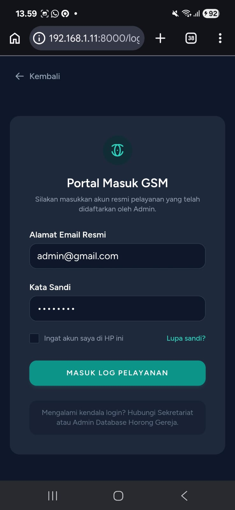
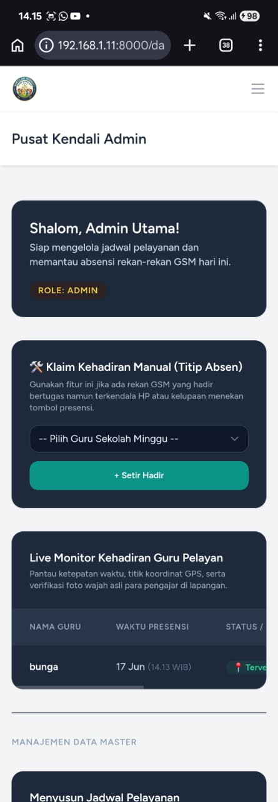
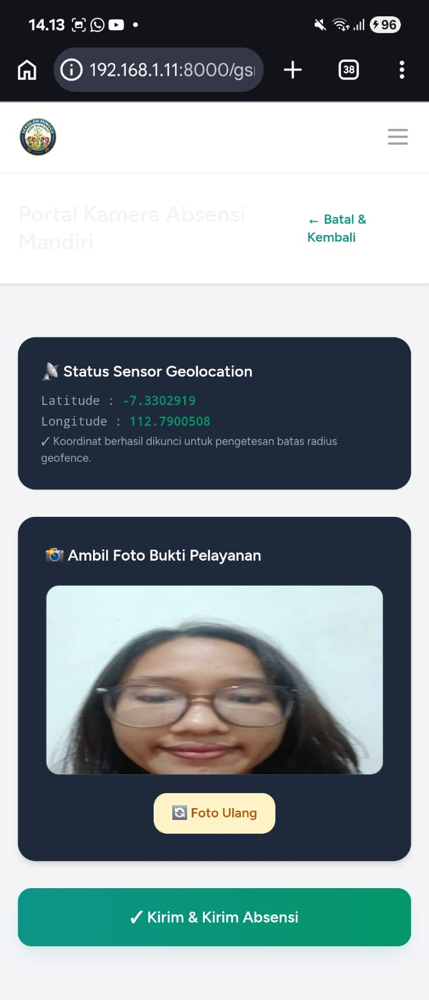
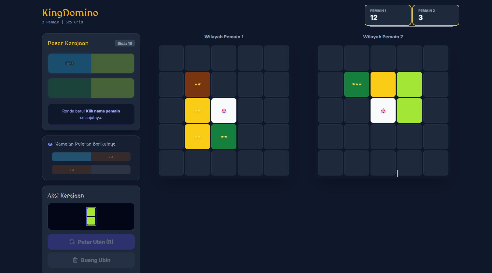
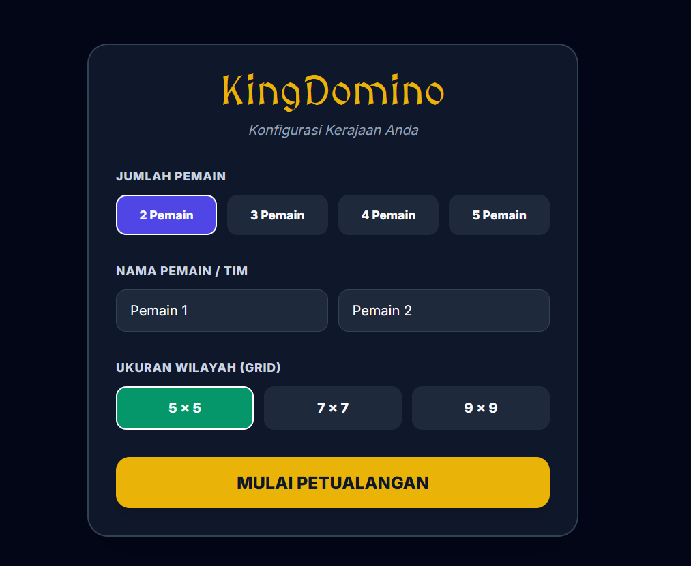

# 💫 About Me:
💻 Full-Stack Engineer | Certified BNSP Junior Web Programmer | Turning complex code into elegant web solutions. High school IT Instructor turned software developer. React.js • Laravel • Node.js • Python

# 💻 Tech Stack:
          

---

# 🚀 Highlighted Projects:

### ⛪ 1. Sunday School Ministry Attendance & Agenda Portal
A mobile-first web ecosystem built to automate and secure presence logs for Sunday School teachers (GSM). It replaces manual spreadsheets with structured digital workflows and location verification.
* **Role Privileges:** Features a dual-role architecture—**Admin** manages user database entries, curriculums, schedules, and reviews global logs, while **GSM** accesses active agendas and submits attendance tokens.
* **Core Integrity:** Implements a strict **Geofencing Verification Engine** (via server-side Haversine calculation) alongside native hardware camera integration for identity validation (**Biometric Selfie Attachment**). Logs represent individual service entry presence (no checkout needed).
* **Tech Stack:** `Laravel 11` • `React.js` • `Inertia.js` • `SQLite` • `Tailwind CSS`

  
  
  

 

### 👑 2. Kingdomino Game Engine Reconstruction
A full digital recreation and programmatic architecture of the award-winning tile-placement board game, *Kingdomino*. This project emphasizes algorithmic state calculation, spatial tile logic, and interactive mechanics.
* **Core Mechanisms:** Features full grid expansion logic ($5 \times 5$ domino constraints), automatic multiplier calculations based on connected properties (crowns $\times$ territory size), dynamic turn ordering based on domino card values, and real-time validation of invalid tile placement configurations.
* **UI/UX Design:** Implements clean board-game interfaces, fluid interactive click/drag controls, and crisp component modularization to ensure lightweight deployment states.
* **Tech Stack:** *[Isi dengan Tech Stack Game Kingdomino kamu, contoh: React.js • TypeScript • Tailwind CSS]*

  
  

---

# 📊 GitHub Stats:
 
 

---

<!-- Proudly created with GPRM ( https://gprm.itsvg.in ) -->
